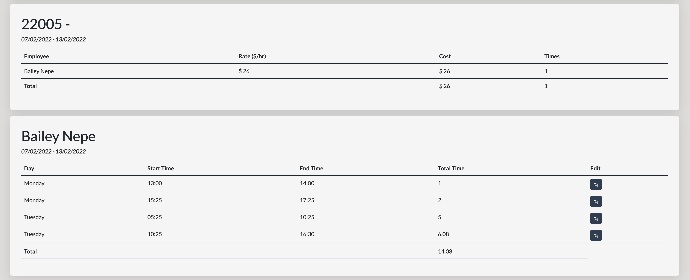

# Dreams Built Project

**_Currently still a work in progress, ETA completion 20/3/2022_**

## Aim

The aim of this project was to build a website that enables small to medium sized businesses the ability to provide an online timesheet to employees and then display the timesheet information in user and job reports which automates the administration duties of payroll and job labour costing.

The project is also able to be utilised for job planning and scheduling on a weekly calendar with each job being able to be broken into subparts and easily customised by the business.

## Technology

**MERN Stack**

- MongoDB and Mongoose
- NodeJS and Express
- React
- Redux
- Docker
- Auth0 - Role Based Access Control
- Jest

---

## Current State of project

### User Dashboard

### Employee Dashboard

### Admin Dashboard

### Timesheet

### Timesheet Reports

### Jobs

### Schedule

