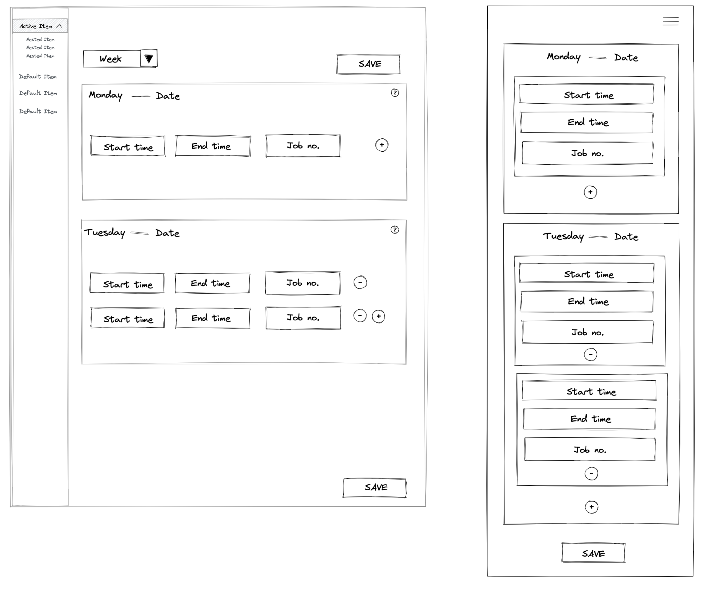

# Dreams built Website

## Objective

- To create a website for DreamsBuilt that allows customers to view general details on the business.
- To allow customers to contact the company.
- To provide an employee portal
- To allow employees to submit weekly timesheets
- To allow admin staff to create reports
- To create a project management software

## Public Website

- Display general information for public
- Login button for staff
- Contact form

### Technology requirements

**Frontend** - REACT

React gives the required functionality for this part of the website. Performance and SEO requirements can be met to an adequate level for the website.

_Components:_

1. Header - includes the navigation bar, logo and login
2. Main content - TBC (possible carousel of jobs, about us section, list of services)
3. Contact - includes a contact form as well as contact information
4. Footer - nav, copyright(dynamic)

**Backend** - Node.js

Node.js will allow the user to send an email through the contact form

**Database** - Not required

### Wireframe

## Employee Portal

- Users can register for an account, but must be approved by an admin
- Can edit their details
- Can submit weekly timesheet
- Can view/adjust availability

Create a UI for logged in users. Sidebar navigation that includes parts that users have privileges to. For example an employee can see their own timesheet but not reports, admin can see reports. Will therefore will need user roles.

### Staff Timesheet

- Timesheet must be weekly and can be filled out daily
- Days can have multiple submissions
- Each entry must have a start and end time and is assigned a job number
- User can search job numbers OR enter the job number
- timesheet must calculate total worked hours
- timesheet saves days to the appropriate week database
- user can edit their timesheet IF it is prior to the following wednesday
- If there is no data, the user must be reminded by text and email

#### Technology

**Frontend** - REACT

Create a fast reliable application

**Backend** - Node.js

Node.js provides a Xero integration.

**Database** - MongoDB/Mongoose

MongoDB allows us to create and store user information as well as store the user's timesheet data.

#### Wireframe

### Admin Portal

- Timesheet report
- Job cost report based on timesheet
- Staff schedule
- Staff details

### Project Management software

- Jobs can be created and dates and times added to the jobs
- Can be integrated/displayed on a calendar
- List of jobs displayed on a gnatt chart

### Additionals

- Job calendar filter and select and email/export button to contractorsx
